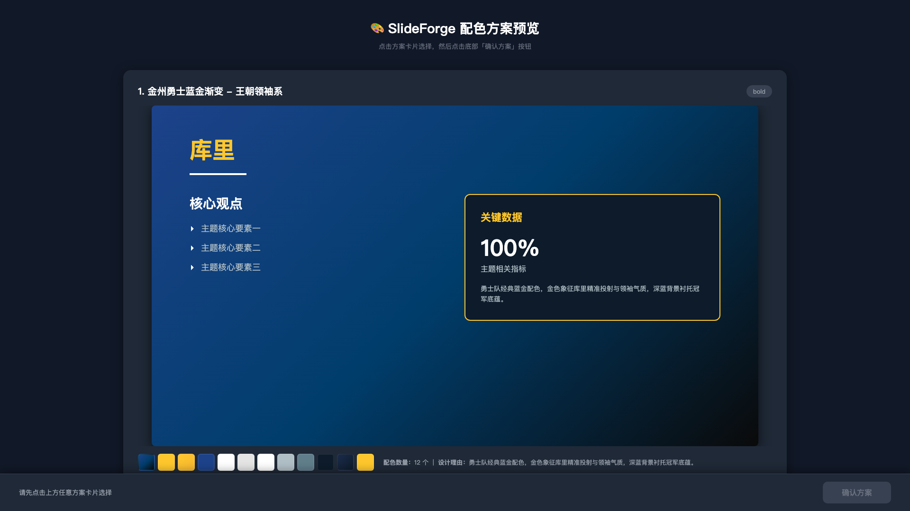
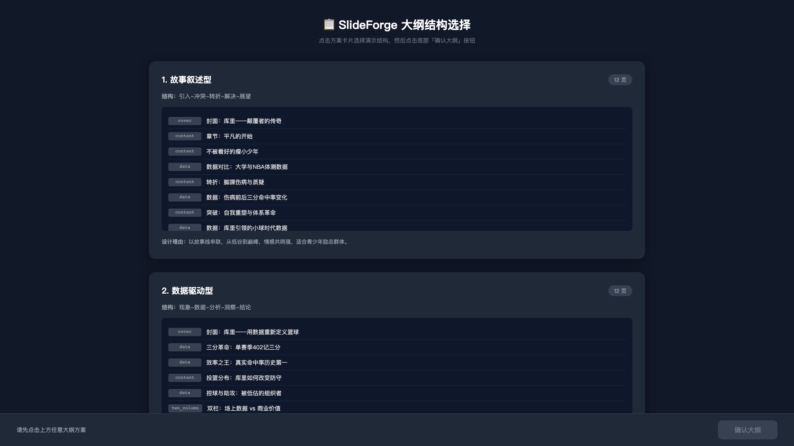

# SlideForge

<div align="center">

🎨 **AI 驱动的演示文稿生成器**

一个完全独立的 PPT 生成系统，通过浏览器交互让用户选择配色方案和大纲结构

</div>

---

## ✨ 特性

- 🎨 **配色方案智能生成** - AI 根据主题生成 3-5 套定制配色方案（支持渐变）
- 📋 **大纲结构可选** - 提供多种演示结构（故事型、数据型、问题解决型等）
- 🖥️ **浏览器交互选择** - 可视化预览所有方案，点击选择
- 🎯 **完全独立运行** - 不依赖任何外部 PPT 项目
- 🚀 **一键生成** - 自动生成 HTML 预览和 PPTX 文件

## 🎬 工作流程

```
1. 启动程序
   ↓
2. AI 生成配色方案 → 浏览器预览 → 用户点击选择
   ↓
3. AI 生成大纲结构 → 浏览器预览 → 用户点击选择
   ↓
4. 根据选择生成详细内容
   ↓
5. 渲染 HTML 预览（自动打开）
   ↓
6. 导出 PPTX 文件（自动打开）
```

## 📦 安装

```bash
# 克隆仓库
git clone https://github.com/lumingze1111/SlideForge.git
cd SlideForge

# 安装依赖
pip install langchain-openai pydantic python-pptx
```

## 🚀 快速开始

```bash
python main.py
```

程序会自动：
1. 生成配色方案并在浏览器打开预览
2. 等待你选择配色方案（点击卡片 → 点击「确认方案」）
3. 生成大纲方案并在浏览器打开预览
4. 等待你选择大纲结构（点击卡片 → 点击「确认大纲」）
5. 自动生成完整 PPT 并打开

## 📸 预览

### 配色方案选择


### 大纲结构选择


### 生成的 PPT


## 🎨 支持的配色特性

- **纯色配色** - 传统的十六进制颜色 `#1976D2`
- **渐变背景** - CSS 线性/径向渐变
  - `linear-gradient(135deg, #667eea 0%, #764ba2 100%)`
  - `radial-gradient(circle, #0d0d2b 0%, #1a1a3e 100%)`
- **渐变文字** - 使用 `background-clip: text` 实现渐变标题
- **自适应配色** - 根据主题自动生成高对比度配色

## 📋 支持的大纲结构

- **故事叙述型** - 引入 → 冲突 → 转折 → 解决 → 展望
- **数据驱动型** - 问题 → 数据洞察 → 趋势 → 结论
- **问题解决型** - 现状 → 问题 → 方案 → 效果
- **对比分析型** - 传统方式 vs 新方法 → 优劣对比

## 🎯 幻灯片类型

支持 6 种幻灯片类型：

| 类型 | 说明 | 适用场景 |
|------|------|----------|
| `cover` | 封面页 | 标题 + 副标题 |
| `section` | 章节过渡页 | 章节标题 + 说明 |
| `content` | 内容页 | 标题 + 要点列表（3-5条） |
| `two_column` | 双栏对比页 | 左右对比内容 |
| `data` | 数据展示页 | 关键数据 + 背景说明 |
| `closing` | 结尾页 | 总结 + 行动号召 |

## 🛠️ 技术栈

- **LLM** - DeepSeek Chat API（可替换为其他 OpenAI 兼容 API）
- **UI Framework** - LangChain + Pydantic
- **PPT Generation** - python-pptx
- **Web Preview** - HTML + CSS + JavaScript
- **交互机制** - HTTP Server (多线程)

## 📂 项目结构

```
SlideForge/
├── main.py                          # 主入口
├── slideforge/
│   ├── agents/
│   │   ├── propose_agent.py        # 配色方案生成
│   │   ├── outline_proposal.py     # 大纲方案生成
│   │   └── html_generator.py       # 内容生成与渲染
│   ├── preview_generator.py        # 浏览器预览生成
│   └── pptx_exporter.py            # PPTX 导出
└── README.md
```

## ⚙️ 配置

修改 `main.py` 中的 LLM 配置：

```python
llm = ChatOpenAI(
    base_url="https://api.deepseek.com",      # API 端点
    api_key="your-api-key-here",              # API 密钥
    model="deepseek-chat",                     # 模型名称
    temperature=0.7,                           # 生成温度
)
```

也可以修改默认主题、受众和页数：

```python
topic = "你的演示主题"
audience = "目标受众"
pages = 8  # 幻灯片页数
```

## 🎯 使用场景

- 快速制作演示文稿原型
- 设计多套配色方案供团队选择
- 探索不同的演示结构
- 学习演示文稿设计最佳实践

## 🤝 贡献

欢迎提交 Issue 和 Pull Request！

## 📄 许可证

MIT License

## 🙏 致谢

- [LangChain](https://github.com/langchain-ai/langchain) - LLM 应用框架
- [python-pptx](https://github.com/scanny/python-pptx) - PPTX 生成库
- [DeepSeek](https://www.deepseek.com/) - AI 模型支持

---

<div align="center">
Made with ❤️ by SlideForge Team
</div>
